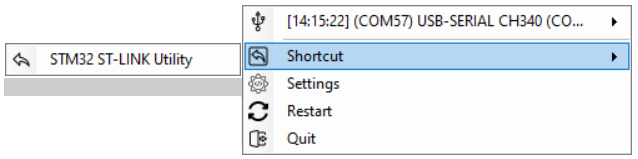
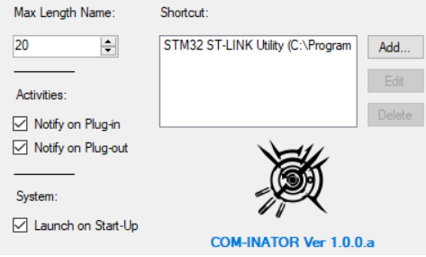

# Cominator - COM Monitor
Detects & displays serial ports connected to or removed from your Windows system. Add shortcut for faster use.

## Feature
- Low RAM usage, built with C# and Windows libraries, no add-ons required
- No polling loops, zero background CPU usage (uses device list update notifications)
- GUI for easy configuration
- Customizable shortcuts and bindings
- Options to enable/disable notifications and control startup behavior
- All functions accessible via right-click menu

## Install
1. Download the release from this repository, unpack and run `Cominator.exe`
2. Alternatively, clone this repository and compile it yourself (requires `Microsoft .NET Framework 4.5.2`)
## Usage

- Run the application
- Go to settings and configure your preferences
- Plug in a serial COM port and voilà!